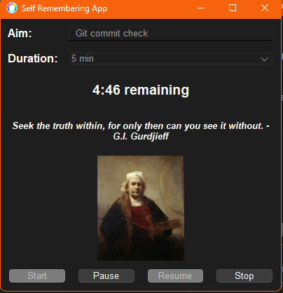
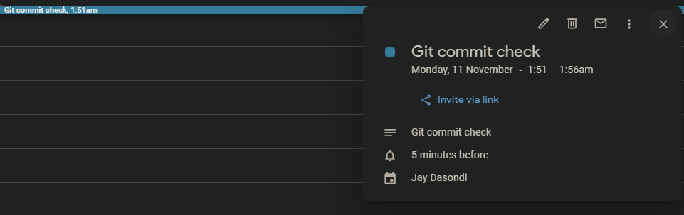

# **Self Remembering App**

**Self Remembering App** is a PyQt6-based desktop application designed to help users manage focus sessions effectively. It integrates with Google Calendar, provides inspirational quotes, and offers sound notifications to enhance productivity and mindfulness.

## **Features**

- **Session Timer**: Choose from predefined durations (5 min, 15 min, 25 min, 30 min, 45 min, 1 hour) to set focus sessions.
- **Inspirational Quotes**: Displays a random inspirational quote during each session to keep you motivated.
- **Google Calendar Integration**: Automatically creates and updates events in your Google Calendar corresponding to your focus sessions.
- **Sound Notifications**: Plays a Tibetan bowl sound at the start and end of each session.
- **Inactivity Detection**: Pauses the session if no activity is detected for over 5 minutes, ensuring you stay mindful.
- **User-Friendly Interface**: Simple and intuitive UI built with PyQt6.

## **Installation**

### **Prerequisites**

- **Python 3.7+**
- **pip** (Python package installer)
- **Required Python Packages**:
  - **PyQt6** (version 6.5.0)
  - **pygame** (version 2.5.3)
  - **google-auth** (version 2.23.0)
  - **google-auth-oauthlib** (version 0.9.0)
  - **google-api-python-client** (version 2.99.0)

### **Steps**

1. **Clone the Repository**

   Open a terminal and run the following commands to clone the repository and navigate into the project directory:

   ```bash
   git clone https://github.com/colorfuldata/self-remembering-app.git
   cd self-remembering-app
    ```

# User Interface:

## 1. Self Remembering App Interface



This screenshot shows the Self Remembering App interface where users can input their session aim (e.g., "Git commit check"), select the duration (5 minutes in this case), and see a countdown of the remaining time. An inspirational quote is displayed, and the interface allows users to start, pause, resume, and stop the session.

## 2. Google Calendar Event Notification



The second image shows a Google Calendar event notification. The event is automatically created for the focus session. In this case, a Git commit check event has been created in the calendar, and a notification is shown 5 minutes before the event's start time.

If a user exits or stops the session early before the timer ends, the application updates the calendar event with the actual real-time session end. This ensures that the event in Google Calendar reflects the accurate duration of the session.